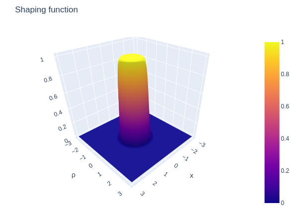
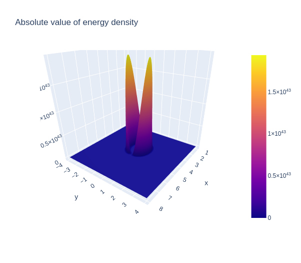
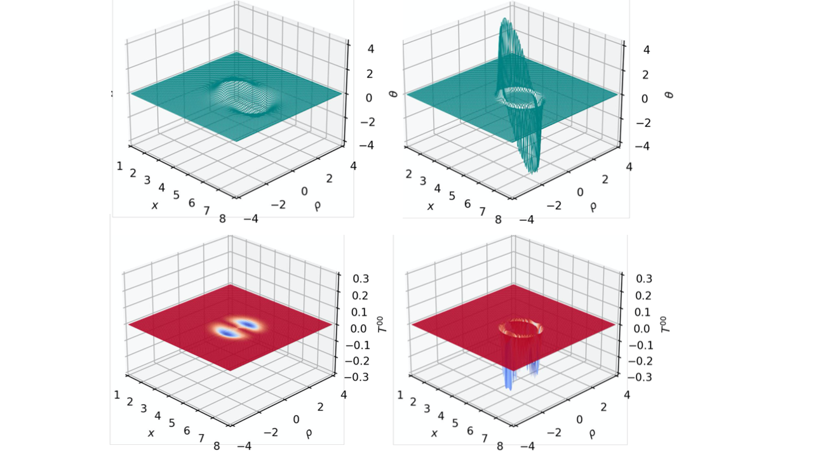
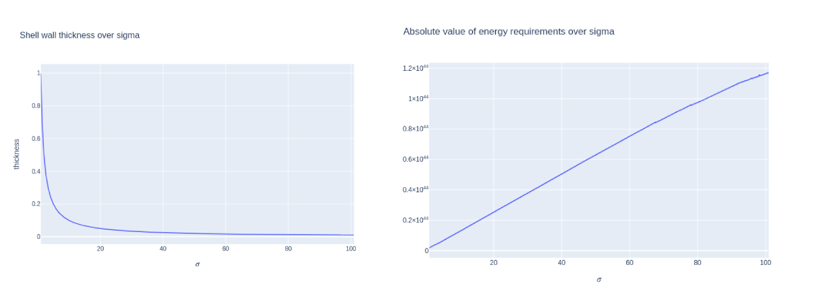
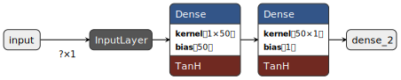
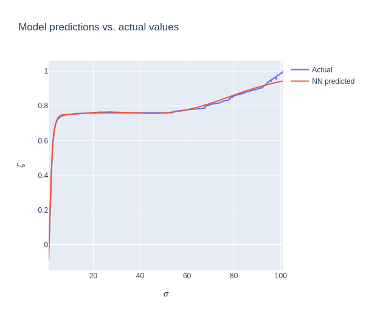
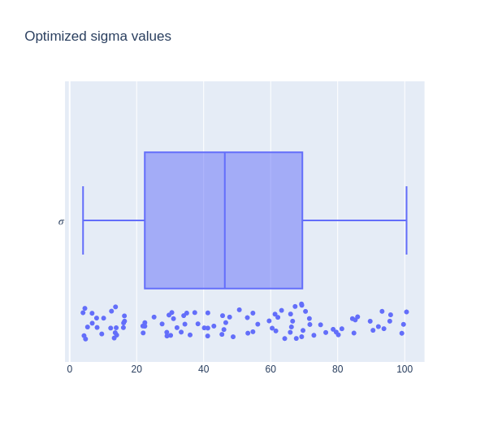

# On the machine-learning assisted optimization of Alcubierre-like spacetime metrics

The Project Elära contributors

## Abstract

The Alcubierre metric is a theoretical method by which faster-than-light travel may be achieved within the context of General Relativity. It is mathematically shown how the metric is constructed and has characteristics favorable for interstellar spaceflight. The notable shortcomings of the metric, notably, the necessity of unattainably high energy requirements, are then noted, and methods of modifying the metric to decrease energy requirements are discussed. Lastly, it is conceptually shown how a neural network may be implemented to devise variants of Alcubierre-like spacetime metrics with modified characteristics, capable of reducing total energy requirements. An implementation of such a neural network is then discussed, and a conceptual interstellar mission to the TRAPPIST-1 system using such a method of interstellar travel is then briefly considered.

## Theoretical Basis

Under General Relativity, conventional means of spacecraft propulsion are limited by the speed of light. As such, a time span of several years to several decades is required for a voyage to the nearest star systems, making such means of propulsion hardly ideal for interstellar travel [1]. One, and indeed perhaps the most studied, means of circumventing this issue, is to propel a spacecraft forward by contracting spacetime in front of it, and expanding spacetime behind [2]. The distortion of spacetime around the spaceship creates a "warp bubble" around the ship, which is described the context of General Relativity as the Alcubierre metric:

$$
d s^2=-c^2 d t^2+\left[d x- v_sf\left(r_s\right) d t\right]^2+d y^2+d z^2
$$

The characteristics of the metric arise primarily from its shaping function $f(r_s)$, where $f = 0$ in all regions except for a localized region of spacetime distortion $[0, R]$, where $R$ denotes the radius of the warp bubble. The shaping function is given by:

$$
f\left(r_s\right)=\frac{\tanh \left(\sigma\left(r_s+R\right)\right)-\tanh \left(\sigma\left(r_s-R\right)\right)}{2 \tanh (\sigma R)}
$$

$$
r_s(t) = \sqrt{(x - x(t))^2 + y^2 + z^2}
$$

*Figure 1: a plot of the shaping function $f(r_s)$*

Under General Relativity, the stress-energy tensor of the Einstein Field Equations 
describes the distribution of mass-energy needed to produce a corresponding spacetime geometry. The energy density corresponding to the Alcubierre metric, therefore, is given by $T^{00}$, where:

$$
T^{00}= \frac{c^4}{8 \pi G} G^{00} = -\frac{c^4}{8 \pi G} \frac{v_s^2 \rho^2}{4 r_s^2}\left(\frac{d f}{d r_s}\right)^2
$$

Of which the total negative mass-energy requirement is given by:

$$
E_{\mathrm{req.}} = \int T^{00} dV
$$

_Figure 2: a plot of the absolute value of the energy densities_

The magnitude of spacetime distortion from the metric is given by the York time, where:

$$
\theta = v_s \frac{x_s}{r_s} \frac{df}{dr_s}
$$

It has previously been found that to maintain the Alcubierre metric, at least in its original conception, the total energy requirement must be roughly [3]:

$$
E \approx -3 \times 10^{20} M_{\mathrm{galaxy}} \, v_s
$$

Therefore, any further discussion of the metric hinges on the ability for the metric to be  optimized and for energy requirements to be reduced.

## Mitigation of energy requirements

Up to this point, only the characteristics and energy density associated with the basic form of the Alcubierre metric have been analyzed. The Alcubierre metric may be modified from its basic form by changing the value of $\sigma$, the shell thickness controlling parameter [4]. As $\sigma$ is inversely proportional to the shell thickness, the choice of a higher $\sigma$ results in a thinner shell wall, while a lower $\sigma$ results in a thicker shell. The thickness of the shell directly affects the York Time magnitude, which in turn, affects the magnitude of the energy densities, allowing for the possibility of lowering the energy density requirement for the Alcubierre metric.

The following graphs are graphs of York time and energy density for differing shell parameters, namely with a low and high $\sigma$ value:

_Figure 4: York time plots of $\sigma = 2$ on the left, $\sigma=12$ on the right_

The transition region between the flat spacetime within the center of the warp buble and the flat spacetime outside of the warp bubble is referred to as the shell wall, where the entirely of the expansion and contraction of spacetime is localized. The shell wall thickness is inversely proportional to $\sigma$. Therefore, as the value of $\sigma$ increases, the bubble thickness decreases. From the first two plots of York time in Figure (4), it can be seen that a thicker shell wall reduces the York time magnitude; from the latter two plots of York time in the same figure, we see that doing so decreases the energy density. We come to the conclusion that by decreasing $\sigma$, the energy requirement can be substantially reduced. 
This technique, however, comes with the unappealing characteristic that while thicker warp shells may require less energy to create, they also have less usable 
flat space within, which reduces the maximum size of the ship occupying 
the space. To resolve both issues at once, a novel technique is necessary.

## ElaraNet: a neural network-based optimizer

It has previously been shown that conventional parameter-based approaches to reducing energy requirements for the Alcubierre metric are practically limited by spacecraft size. This section will introduce ElaraNet, a neural network-based optimizer for the Alcubierre metric, which aims to find ideal parameters to reduce energy requirements while maintaining sufficient internal volume.

Rather than simply optimizing for energy requirements, ElaraNet optimizes over $\zeta$, where:

$$
\zeta(\sigma) = \frac{\sigma}{|E_{\mathrm{req.}}(\sigma)|}
$$

Doing so allows the shell wall thickness to be minimized (that is, to have maximum internal volume), and the energy requirement to be minimized as well.

_Figure 5: both the shell wall thickness and the energy requirement is minimized by the neural network_

In order to be suitable for optimization, ElaraNet has an associated dataset generator consisting of a numerical integrator to find the value of $E(\sigma)$ given arbritrary values of $\sigma$, where $E(\sigma)$ is:

$$
E(\sigma) = \int T^{00} dV
$$

A dataset of 2000 samples was generated, and used to train a two-layer densely-connected model to approximate the function $\zeta(\sigma)$. All values of $\zeta$ where normalized within a $[0, 1]$ range, and the neural network was trained for 5000 epochs.

_Figure 6: Architecture of ElaraNet_

_Figure 7: Training results after 5000 epochs_

Then, a numerical optimizer was used to optimize for ideal values of $\sigma$ given the neural-network approximation of $\zeta(\sigma)$. The results of the optimizer are given below, suggesting $\sigma \approx 20-45$ as a suitable value:

_Figure 8: Output $\sigma$ value given by ElaraNet optimizer for 100 trials_

## Mission planning with a warp-capable spaceship

With a suitable metric with sufficiently reduced energy requirements, a spaceship design making use of the metric may drastically reduce interstellar travel times. This would enable travel within human timespans to stellar systems conventionally considered out of reach within a human lifetime. Of particular interest is the TRAPPIST-1 star system, 40 light years from Earth, containing 4 potentially habitable Earth-like planets. A warp-capable spaceship with $v_s = 40c$ would allow travel to the star system within less than 1 year, or even within months at $v_s > 40c$, rather than the centuries required for subluminal propulsion systems that approach $v = 0.1c$. Warp-capable spaceships would open the doors to reliable, fast interstellar travel, and pave the way to an interstellar civilizations.

## Critical evaluation of results

While initial results may appear to be promising, several flaws must be noted in both the implementation of the neural network-based optimizer and the optimized sigma values shown in Figure 8. Primarily, within the results, the wide range and scattered nature of the sigma values suggests that the optimizer is not necessarily optimizing $\zeta$, and may be simply choosing randomized values. The calculation of the total energy requirement from $T^{00}$ utilized a numerical integrator rather than an analytic solution to the volume integral, incurring a likely disparity from the actual value of $E(\sigma)$. Additionally, the neural network-based optimizer's limited training data set of just 2,000 samples may be insufficient for the neural network approximation to be effectively optimized. Future research would involve rectifying these points of concern.

## Concluding remarks

The primary characteristics of the Alcubierre metric have been demonstrated and its associated spacetime geometry analyzed quantitatively. Further, a prototype neural network-based optimizer has been developed for the purpose of reducing energy requirements for the Alcubierre metric, and its implemenation has been discussed. The neural network optimizer could further be improved by the incorporation of a solver of the Einstein Field Equations, which would allow more substantive changes to the metric for further energy requirement reduction.

## Bibliography

All images were created by the researcher. The SciPy, SymPy, NumPy, and TensorFlow libraries were used in the creation of the neural network optimizer. All work shown was original.

[1]: “Warp Field Mechanics 101 - NASA Technical Reports Server (NTRS).” *Ntrs.nasa.gov*, ntrs.nasa.gov/citations/20110015936.

[2]: Alcubierre, M. (2000). The warp drive: hyper-fast travel within general 
relativity. ArXiv. https://doi.org/10.48550/ARXIV.GR-QC/0009013

[3]: M. J. Pfenning and L. H. Ford, “The unphysical nature of warp drive,” Class. Quant. Grav. 14, 1743, (1997).

[4]: White, H. G. (2006). The Alcubierre Warp Drive in Higher Dimensional 
Spacetime. In AIP Conference Proceedings. AIP. https://doi.org/10.1063/1.2169323
