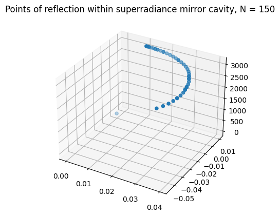
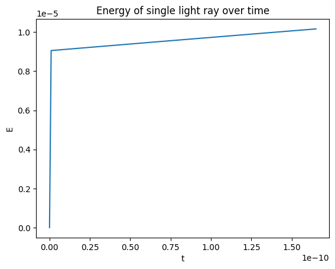

# Conducting simulations into the energy generation possibilities of black hole superradiance reactors

Yuxuan Song

## Abstract

Black hole superradiance reactors utilize the phenomenon of superradiant scattering as a means to extract energy out of rotating black holes. In this paper, a computational simulation of such a reactor is discussed, implemented, and analyzed.

## Introduction

Human advancement has gone hand-in-hand with the discovery of new energy sources: from coal, to petroleum, to nuclear fission, and most recently, to renewable sources of energy. Black holes are an untapped energy source. As up to 29% of the rotational mass-energy of a black hole may be extracted [1], the highest of any energy source other than antimatter, black hole reactors may certainly augument, and perhaps one day replace, traditional energy sources.

Due to the effect of frame-dragging predicted through General Relativity, rotating bodies drag spacetime with them, causing objects in the immediate vicinity to co-rotate with the rotating body. Rotating black holes, described by the Kerr metric, contain a region where the effect of frame-dragging is sufficient that even light must co-rotate with the black hole. Such a region is known as the ergosphere, and it is this feature which allows for the possibility of energy extraction from black holes.

This research is centered on black hole energy generation through utilizing the superradiance effect, where light trapped around a rotating black hole would be amplified in the black hole's ergosphere. A reflective cavity enclosing the black hole would cause exponential amplification, and an outlet in the cavity would produce a concentrated super-high-energy beam, capable of then being distributed.  Such reactors would also require the creation and manipulation of artificial kugelblitz black holes, generated from extreme concentrations of energy. Currently, superradiant scattering is poorly understood; it is hoped that with computer simulations of superradiance reactors, insights may be gained into the phenomenon, and we may be one step closer to realizing black hole energy generation.

## Computational simulation

A black hole superradiance raytracer was created to simulate the effects of superradiant scattering within an icospherical cavity. A model of the cavity of approximately 2m diameter was first created. The black hole simulated was a 1 solar mass black hole, with a the reactor cavity 100 meters wider than its ergosphere, with a radius of approximately 3064 m.

The basic operation of the raytracer is as follows: it shoots a single ray, then records the trajectory traced by the ray as it travels along a Kerr geodesic along the black hole. After each bounce, it records the last known trajectory of the light ray, and continues tracing the ray given its new velocity vector computed after the reflection.

To record the trajectory of the ray, the raytracer uses a Runge-Kutta 4th order solver. The solver computes the geodesic by computing the derivative at each point:

$$
\frac{d}{dt} \begin{bmatrix} \dot x^\mu \\ \ddot x^\mu \end{bmatrix}= \begin{bmatrix} {\dot x}^\mu \\ -{\Gamma^\mu}_{\alpha \beta} \dot x^\alpha \dot x^\beta \end{bmatrix}
$$

Where the Kerr metric is given by [2]:

$$
ds^2 = -\left(1 - \frac{2 M r}{\Sigma}\right) dt^2 + \frac{\Sigma}{\Delta} dr^2 + \Sigma d\theta^2 + \left(r^2 + a^2 + \frac{2 M r a^2}{\Sigma} \sin^2 \theta \right) \sin^2 \theta d\phi^2 - \frac{2 M r a sin^2 \theta}{\Sigma} dt d\phi
$$

The value of the derivative is found by utilizing automatic differentiation of the metric coefficients to compute the Christoffel symbols via:

$$
\Gamma^m_{ij} = \frac{1}{2} g^{km} \left(\frac{\partial g_{ik}}{\partial x^j} + \frac{\partial g_{jk}}{\partial x^i} - \frac{\partial g_{ij}}{\partial x^k}\right)
$$

The initial conditions of the raytracer were obtained by setting the origin of the light rays to be a point just inside the reflective cavity at its very top, and setting the following velocities:

$$
v_r = c
$$

$$
v_\theta = \theta_0
$$

$$
v_\phi = \phi_0
$$

Conversions between spherical and cartesian velocities were obtained using the following relations:

$$
v_r = \frac{xx' + y y' + zz'}{r}
$$

$$
v_\theta = \frac{z r' - rz'}{r^2 \sqrt{1 - \left(\frac{z}{r}\right)^2}}
$$

$$
v_\phi = \frac{xy' - y x'}{x^2 + y^2}
$$

$$
v_x = r \cos \phi \cos \theta \theta' + \sin \theta \cos \phi r' - r \sin \phi \sin \theta \phi'
$$

$$
v_y = r \sin \phi \cos \theta \theta' + r \sin \theta \cos \phi \phi' + \sin \phi \sin \theta r'
$$

$$
v_z = \cos \theta r' - r \sin \theta \theta'
$$

And finally, after each bounce, the $v_\theta$ and $v_\phi$ components of the new velocity vector were found using a projection matrix after vector decomposition. This is done by decomposing the 3D incoming vector $\vec a$ and normal vector $\vec N$ into two 2D vectors in the $y = 0$ and $x = 0$ plane. This is done by respectively setting $y = 0$ for $\vec a_y$ to get the projection of the vector in the plane $y = 0$, and setting $x = 0$ for $\vec a_x$ to get the projection of the vector in the plane $x = 0$, and doing the same for the normal vector:

$$
\vec a_y = 
\begin{bmatrix}
a.x \\
a.z
\end{bmatrix}
$$

$$
\vec a_x = 
\begin{bmatrix}
a.y \\
a.z
\end{bmatrix}
$$

$$
\vec N_y = 
\begin{bmatrix}
N.x \\
N.z
\end{bmatrix}
$$

$$
\vec N_x = 
\begin{bmatrix}
N.y \\
N.z
\end{bmatrix}
$$

Then, the angles can be found in 2D using the 2D projections of the 3D incoming and normal vectors:

$$
\theta_y = \frac{a_y \cdot N_y}{\|a_y\| \|N_y\|}
$$

$$
\theta_x = \frac{a_x \cdot N_x}{\|a_x\| \|N_x\|}
$$

The 2D projections of the outgoing vector $\vec b$ can be found by applying the rotation matrix $R(\theta)$ to the flipped 2D normal projection vector: 

$$
\vec b_y = R(\theta_y) \times (-\vec N_y)
$$

$$
\vec b_x = R(\theta_x) \times (-\vec N_x)
$$

From which the final outgoing vector $\vec b$ can be found:

$$
\vec b = \begin{bmatrix}
c_y.x \\
c_x.x \\
c_y.z
\end{bmatrix}
$$

After 150 bounces, the points of reflection were obtained as follows:

The energy of the light ray was also found by taking the path integral of the frequency along its trajectory:

$$
E = h \int_C \frac{Mrac}{\pi \Sigma^2} \cdot ds
$$

Through numerical evaluation of the line integral, a plot of the energy of the light ray was created:

## Critical evaluation of results

Some notable issues that were possibly present in the research include a low sample count for reflections, a high error tolerance for determining point-surface intersection, and division-by-zero errors encountered due to limited precision. They may be addressed in future research.

## Concluding remarks

In this research, it is shown that, consistent with theoretical predictions, the superradiant scattering of light around a Kerr black hole causes an increase in the energy of the light ray. This simulation of a solar mass black hole, to be supplemented by further research, represents a first step in demonstrating the feasibility of a construction of an actual black hole superradiance reactor.

## Bibliography

[1]: East, W. E., & Pretorius, F. (2017). Superradiant instability and backreaction of massive vector fields around Kerr black holes. *Physical review letters*, *119*(4), 041101.

[2]: Rezzolla, Luciano; Zanotti, Olindo (2013). [*Relativistic Hydrodynamics*](https://books.google.com/books?id=aS1oAgAAQBAJ&pg=PA57). Oxford University Press. pp. 55--57 [eqns. 1.249 to 1.265]. [ISBN](https://en.wikipedia.org/wiki/ISBN_(identifier) "ISBN (identifier)") [978-0-19-852890-6](https://en.wikipedia.org/wiki/Special:BookSources/978-0-19-852890-6 "Special:BookSources/978-0-19-852890-6").
