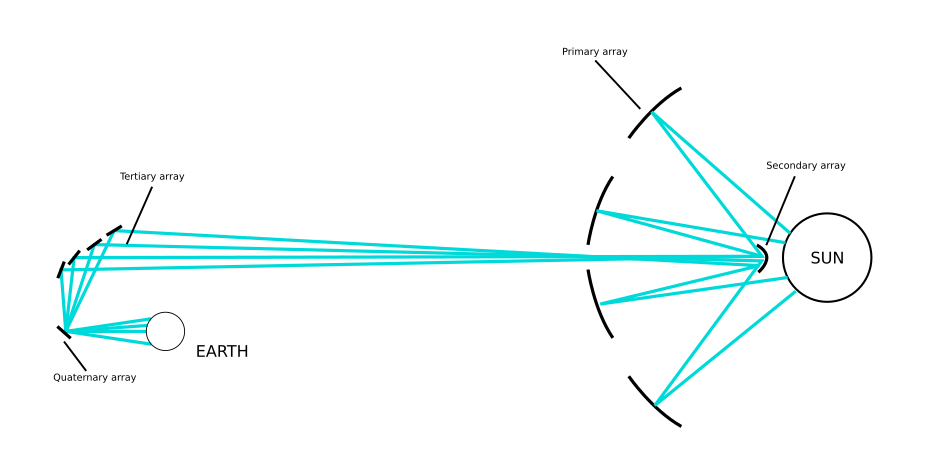
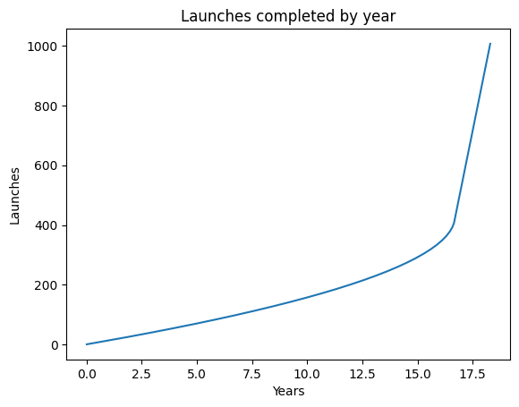
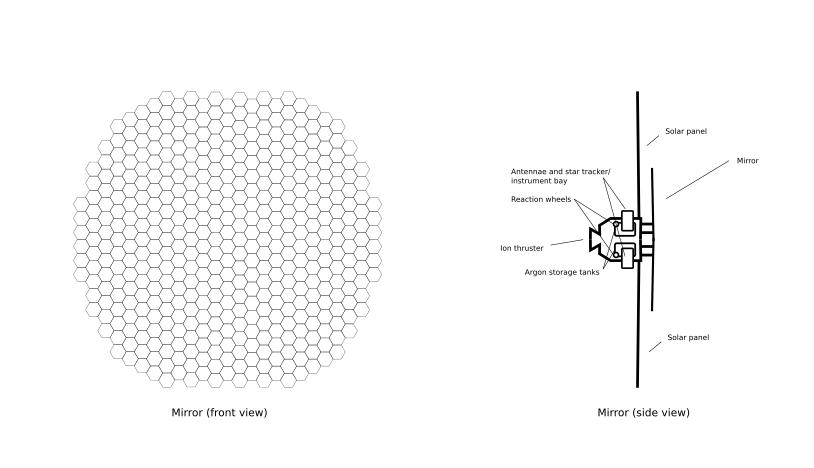
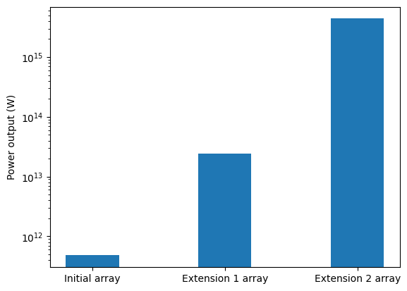

# A novel technique for space-based energy generation

The Project Elära contributors

## Abstract

A technique is proposed for space-based energy generation through the construction of a space-based solar array. This technique provides a source of essentially limitless energy, has the potential to assist in solving the pressing climate challenges of the 21st century, and is scalable to meet the energy needs of human civilization for millenia to come. A theoretical basis is detailed for this project, a roadmap for implementation and construction, a vision for project success, and future possible extensions of the project.

## Introduction & Theoretical Basis

_Fig 1: An example of a mirror in the Project Elära array_

The project is based on a system of space-based circular mirrors to concentrate, transport, and deliver solar energy to Earth.

For the project, an array of 1,000 100-meter radius mirrors will be placed in an orbit at 0.3 AU from the Sun. Each mirror will be fully mobile, with a small ion engine to facilitate changes of position and trajectory. At this orbit, the Sun’s power output is 15,405.7 watts per square meter. A series of four mirror arrays will direct light from the sun towards first long-distance beaming mirrors located in lower solar orbit, then to a mirror array trailing earth, then to orbiting mirrors around Earth’s L2 point. The final quaternary array will then split apart the concentrated light beam into lower-energy sub-beams to transmit to terrestrial receiving stations on Earth, positioned as follows:

_Fig 2: The primary, secondary, tertiary, and quaternary array_

Earth-based receiving stations will consist of large ground-based arrays of rectennas that will be able to convert the beam directly into electricity for further distribution. It has been calculated that the initial 1,000 mirror prototype array will generate 4.8 x 1011 watts of power, the equivalent of 495 nuclear power plants or 685 gas turbine power plants, allowing the replacement of countless conventional fossil fuel power plants and the generation of clean electricity.

## Mission planning

For Project Elära, existing infrastructure and facilities will be used to the highest capacity possible. Mirror segments will be constructed in 1-meter diameter hexagonal segments, and the propulsion and solar panel modules will also be constructed in similarly lightweight, compact components to facilitate launches from small-lift launch vehicles. While any small-lift launch vehicle is usable, the Rocket Lab Electron rocket was selected to be the most suitable, owing to its low cost, high reliability, and relative ease-of-use. Launches are expected to take place at a pace of one launch per 4 weeks to begin with, and gradually increase in frequency to complete the solar array within 30-50 years. Power generation, however, is expected to begin within 10 years, as the array is capable of operating before all primary mirrors are in place.

_Fig 3: Projected launch schedule, given initial launches every 28 days and 15 launches conducted per launch schedule_

All mirror components will be injected into a shared orbit with the International Space Station (ISS). Once in orbit, the components will be constructed by astronauts of the ISS, supplied with their argon propellant for their ion engines, and then launched under their own power to enter their designated orbits. The orbits for each of the arrays will be as follows:

| **Array** | **Orbit** | 
|-----------|-----------|
| Primary | Heliocentric; 0.3 AU from Sun |
| Secondary | Heliocentric; 0.25 AU from Sun |
| Tertiary | Heliocentric, trailing Earth; 0.15 AU from L2 point |
| Quaternary | L2 point of Earth |

Once in operation, the primary, secondary, and tertiary arrays will direct sunlight to the quaternary array, which will convert the primarily visible-light and infrared light beam to microwaves to facilitate terrestrial reception. At the same time, large ground-based receiving stations will be constructed around the Earth, equipped with substantial rectenna arrays to receive and convert the microwaves beamed from the quaternary array to electricity.

Occasional orbital adjustments will be performed through firing the mirrors’ ion engines, but mirror alignment and directional changes will be performed through traditional reaction wheels. Argon refueling for the mirrors’ ion thrusters, expected once per decade, will be accomplished via reusable robotic fuel resupply missions. Mirror replacements are expected once per 50 years.

## Design & Manufacturing

Each mirror spacecraft consists of two primary components - the flight module, containing the propulsion, solar panels, and communications, and the mirror itself. The flight module includes the primary argon-powered ion engine, reaction wheels, two large solar panel arrays extending for 15m from the left and right of the mirror, low and high gain antenna, star tracker, and primary flight computer of the mirror spacecraft. The mirror is circular and is composed of approximately 140 hexagonal mirror components. A lightweight truss structure connects the mirror to the flight module. The entire spacecraft’s layout is as follows:

_Figure 4: Engineering schematic of the mirror spacecraft_

The mirror is expected to be composed of silver-coated beryllium, and the reflector itself is expected to be no more than 1.5 mm thick to minimize weight and cost. Behind each mirror segment is a similarly-shaped interlocking hexagonal support structure made of aluminum, built to easily be assembled in-orbit. An argon-fed 10 kW Hall effect thruster will serve as the primary means of propulsion for the mirror spacecraft, and will be used for orbital insertion. 8 reaction wheels, 4 mounted on each side of the spacecraft, will guarantee a large degree of directional freedom and redundancy in the case of reaction wheel failure, necessary due to the long lifespan expected of the Project Elära array. The same mirror design is to be used for the primary, secondary, and tertiary array, with the quaternary array mirrors designed differently so as to be able to facilitate the conversion of the primarily visible-light and infrared beam to microwaves for ground-based reception.

Each ground-based receiving station is to consist of up to 150,000 light-tracking rectenna pods. Each pod consists of a upward-facing panel composed of submerged horizontal antennae, rectifiers within the panel to generate DC electricity from the AC induced within the antennae. A traversable pod tracker mount allows for the rectenna pod to be aligned with the quaternary array for the maximum duration possible.

_Fig 6: Schematic of a rectenna pod_

Receiving stations are expected to be constructed in remote areas, where there is minimal environmental interference to maximize power transmission efficiency. The majority of countries will have at least one receiving station each, allowing for space-based power to be equitably distributed worldwide.

## Infrastructural development

Due to the complexity of the project, it is unsurprising that much infrastructure is anticipated to be developed for the project. The infrastructure required for Project Elära consists of two broad categories: ground-based and space-based. Each category has its own infrastructural requirements and challenges.

In terms of space-based infrastructure, the most prominent infrastructure upgrade would be to the ISS. First, new docking ports would be installed to facilitate the transport of larger quantities of material and more frequent crew rotations. Second, a hydroponics module, along with 3D food printers and additional cargo storage bays for food, will improve the self-sufficiency of the station, allowing for raw materials to take up a greater proportion of resupply missions. A miniaturized thorium molten-salt reactor may optionally be mounted to the ISS to provide additional power for in-situ manufacturing aboard, though this is not absolutely required. 

In terms of ground-based infrastructure, a coordinated network of manufacturers will provide mirror components from around the world. Possibilities for international cooperation will be heavily considered and would be heavily advantageous for the project. The Mid-Atlantic Regional Spaceport (MARS), the primary spaceport for Project Elära launches, will be heavily refurbished and expanded to support up to daily launches, as will be required by the end of the project.

## Project Timeline

| Projected Time | Events | 
|------|----|
| Year 1 | Complete research and development; computational simulations; creation of project team; contracting for mirror and receiving station construction | 
| Year 2 | Fix locations for ground receiving arrays for Project Elära; begin receiving station construction; begin infrastructural upgrades for Mid-Atlantic Regional Spaceport | 
| Year 3 | Fabrication of components of first mirror; launch of first mirror on Electron rocket; construction begins on first set of secondary, tertiary, and quaternary receiving mirrors |
| Year 6 | Construction complete for first ground receiving station; ISS incremental upgrades ongoing; additional infrastructure upgrades |
| Year 7 | Completion and launch of first 100 mirrors in primary array |
| Year 9 | Completion of minimum functioning array for secondary, tertiary, and quaternary array |
| Year 10 | First power output from Project Elära |
| Year 35-55 | Completion of project |

## Evaluation and Analysis

The project is highly logistically complex, and, while requiring relatively little new technology, it is heavily dependent on manufacturing, transport, and orbital construction on a massive scale. To reduce costs and speed up the pace of the project, existing mission co-operability will be maximized, as given by the use of existing infrastructure, such as the ISS, the Electron rocket, and MARS. In terms of cost, the project is expected to cost 7.57 billion dollars. However, due to the long duration of the project, the cost per year is much lower, at approximately 189 million dollars per year, roughly 13 times less than the Space Launch System (SLS). Note that while these figures may still seem high, they pale in comparison to the cost of climate change in terms of extreme weather events, droughts, crop failures, floods, and other detrimental effects of climate change, of which just storms comprise 275 billion dollars in damages per year [1]. If realized, Project Elära is capable of entering operation by the year 2038, and attaining full power output by the year 2063, providing a worldwide source of renewable energy and saving countless trillion dollars in climate change damages every year. Therefore, it can be seen that while seemingly costly, the project is a worthy investment in the fight against climate change, and it more than pays off for its initial upfront cost in terms of climate savings.

## Future Extensions

One possible future extension of the project, to be begun approximately a decade to a decade and a half after the initial project, will be an addition of 49,000 mirrors to the primary array. This extension will drastically increase the system’s energy generation potential to $2.42 x 10^{13}$ watts, sufficient to meet all of Earth’s energy needs into the far future and replace all terrestrial energy sources.

For this extension, the same orbital configuration will be used, as well as the same construction method, based on in-orbit assembly of relatively small, lightweight components built on Earth. However, to improve launch efficiency at scale, medium- and heavy-lift vehicles will be used for launches instead, including the in-development Rocket Lab Neutron and Vulcan Centaur. It is expected that this extension will likely take at least 200-300 years altogether to complete. 

Finally, a more speculative extension of the project, to be begun in the distant future, involves the construction of a further 10 billion 10-km radius solar mirrors over an indefinite time frame. These much larger mirrors will be constructed around the orbit of Mercury with resources mined from Mercury’s surface. The mirror array would then be used to create an artificial black hole for a black hole superradiance reactor. This process allows the extraction of up to 29% of the mass-energy of the black hole, the highest of any known energy source with the exception of antimatter [2]. It has been found that a black hole with a mass of 265 million kg and a lifetime of 50 years is able to produce $4.39 x 10^{15}$ watts, enough in a single second to sustain the entirety of human civilization for nearly 500 years.

To realize this extension to the project, the quaternary L2 array will be reconfigured to be able to temporarily and rapidly concentrate solar energy on one point to create the artificial black hole used for the black hole superradiance reactor. In addition, more primary and secondary mirrors will be constructed in Mercury orbit by robotic spacecraft, with further robotic spacecraft deployed on Mercury’s surface to gather raw materials and process them into mirror components. A mass driver will be built on Mercury to facilitate the rapid launch of the mirrors.

After the reconfiguration, the black hole creation procedure would begin. A small spherical pellet consisting primarily of hydrogen ions will be spun to a high fraction of the speed of light by a powerful electromagnet, powered by the Project Elära array. Finally, a rapid, extremely short-duration concentrated beam from the array will be used to create a charged, rotating black hole. The artificial black hole will then be enclosed in a 1-meter radius reactor chamber to allow for energy extraction via superradiant scattering. This process will be repeated every 50 years to replenish the reactor after its black hole has undergone evaporation.

_Fig 7: Projected power output for initial Project Elära array, as well as two proposed project extensions_

## Concluding Remarks

It has been shown how a series of solar arrays has the potential to transform human energy generation within just 3-5 decades, and is able to scale to the ever-increasing need for energy for humanity into the foreseeable future. It has also been shown how an implementation of this proposed project may be carried out. It is hoped that this proposal may undergo serious consideration, and be realized in the near future.

## Bibliography

[1]: _Climate change: This is the impact of extreme weather events on the economy._ World Economic Forum. (2021, September 10). https://www.weforum.org/agenda/2021/09/extreme-weather-events-show-that-climate-change-comes-at-a-cost/
